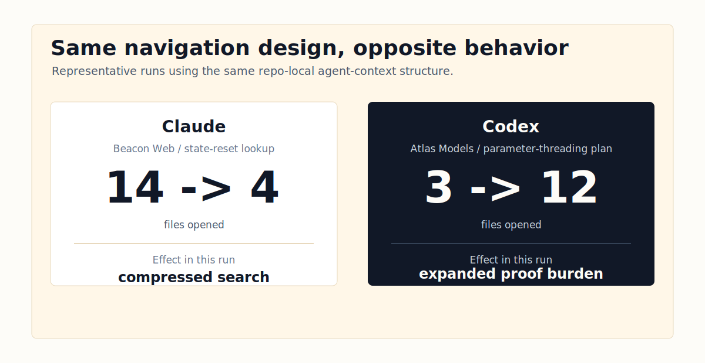

# agent-context


**Checked-in repo evidence for coding agents.**

Commit one `.agent-context/` directory to your repo. Claude, Codex, Cursor, Gemini, and human reviewers get the same content map, authority contracts, search boundaries, and verification hooks before anyone edits code.


```bash
# Install once
git clone https://github.com/cote-star/agent-context.git ~/agent-context

# Add the full artifact set to any repo
cd /path/to/your-repo
~/agent-context/bin/agent-context init --tier 3 .
```

> Or skip the manual fill and let an agent do it: open Claude / Codex / Cursor / Gemini in the repo and ask **"Set up agent context for this repo."** The included [SKILL.md](SKILL.md) drives the rest.

## The cold-start tax

Every coding agent session starts cold. On a real repo it spends the first chunk of every task re-reading the directory tree, guessing ownership boundaries, and missing the one setup file or invariant that should have shaped the answer. That cost compounds over every question, every reviewer, every agent.

`agent-context` turns that repeated exploration into a small, reviewable evidence layer that lives beside the code:

- **Content** — system overview, code map, behavioral invariants, operations notes.
- **Authority** — task routes, completeness contracts, and reporting rules for agents that follow explicit instructions.
- **Navigation** — scoped directories and verification shortcuts for agents that search before trusting.
- **Quality** — manifests, acceptance tests, copied helper tools, and CI-friendly checks.

It is **not** a memory database, orchestrator, crawler, or hosted service. No server, vector store, or API key. Markdown and JSON, committed to your repo.


## Proof

78+ reviewer-graded runs across three real repos — an ML pipeline (501 files), a dual Rust/Node.js CLI (155 files), and a React frontend (1,982 files) — with grep-backed verification of every answer.

| Metric | Bare session | With agent-context | Change |
|---|---:|---:|---:|
| Correct answers | 50% | 88% | **+76%** |
| Files opened by Claude | 6–10 | 1–3 | **~70% fewer** |
| Tokens used by Claude | 40–53K | 4–22K | **58–74% fewer** |
| Dead ends | 2–3 per repo | 0 | **eliminated** |
| Production-risk answers | 7 total | 0 | **eliminated** |


→ [Full results](docs/evidence/results.md) · [metrics summary](docs/evidence/metrics.md) · [evidence dashboard](https://cote-star.github.io/agent-recall/docs/)

## How it works

### 1. Initialize

```bash
~/agent-context/bin/agent-context init --tier 3 .
```


Creates `.agent-context/current/`, copies helper tools into `.agent-context/tools/`, and writes managed routing blocks to `CLAUDE.md`, `GEMINI.md`, `AGENTS.md`, and `.cursorrules`.

### 2. Fill the artifacts

Edit the `REPLACE` markers manually, or hand the work to an agent:

> Set up agent context for this repo.

[SKILL.md](SKILL.md) gives the agent a concrete creation workflow — enumerate every subsystem first (so nothing silently gets skipped), fill all templates, write acceptance tests with grep verification, then run the machine checks.


### 3. Verify

```bash
~/agent-context/bin/agent-context verify .
# OK: agent-context passed machine-checkable validation (tier 3)

~/agent-context/bin/agent-context freshness . --base-ref origin/main
~/agent-context/bin/agent-context doctor
```


`verify` checks structure, JSON schema, real glob matches, and template-variable elimination. `freshness` flags drift between code and pack. `doctor` audits local setup. All three are CI-friendly.

## Architecture: same artifacts, opposite agent loops

The core design is dual routing. **One pack, two reading patterns:**

```text
Trust-and-follow (Claude, Gemini)
  routing block  →  required files  →  completeness contract  →  answer

Search-and-verify (Codex, Cursor)
  search_scope   →  scoped grep     →  verification shortcut  →  answer
```



The same `.agent-context/` content is consumed differently by each agent family. Claude stops when the contract says done. Codex bounds its grep to scoped directories and cross-checks shortcuts. Most authoring projects pick one mode and break for the other; agent-context succeeds for both.


| Layer | Files | Job |
|---|---|---|
| **Content** | `00_*` through `40_*` markdown | Human-readable map, risks, invariants |
| **Authority** | `routes.json`, `completeness_contract.json`, `reporting_rules.json` | What MUST be in a complete answer |
| **Navigation** | `search_scope.json` | Bound search-and-verify agents to relevant dirs |
| **Quality** | `manifest.json`, `acceptance_tests.md`, helper tools | Make the pack auditable and CI-checkable |


```text
.agent-context/current/
├── 00_START_HERE.md
├── 10_SYSTEM_OVERVIEW.md
├── 20_CODE_MAP.md
├── 30_BEHAVIORAL_INVARIANTS.md
├── 40_OPERATIONS_AND_RELEASE.md
├── routes.json
├── completeness_contract.json
├── reporting_rules.json
├── search_scope.json
├── manifest.json
└── acceptance_tests.md

.agent-context/tools/
├── verify_agent_context.py
└── check_freshness.sh
```

→ [Architecture deep-dive](docs/architecture.md) · [16 design principles](docs/design-principles.md)

## Adoption ladder

Start small. Scale when the team is ready. Each tier is a valid stopping point — no hidden dependency on the full pack.

| Tier | Files | Best for | Command |
|---|---:|---|---|
| **1** minimal | 2 | Quick adoption, smaller repos | `init --tier 1 .` |
| **2** standard | 6 | Most teams starting out | `init --tier 2 .` |
| **3** full | 11 | Complex repos, production workflows | `init --tier 3 .` |

## Examples

Two worked examples ship in this repo. Both pass `verify` as-is — clone, read, adapt.

| Example | Size | Why look at it |
|---|---|---|
| [`examples/hello-service/`](examples/hello-service/) | 6 files, ~300 LOC HTTP service | Read the whole pack in five minutes |
| [`examples/agent-chorus-reference/`](examples/agent-chorus-reference/) | 155 files, dual Rust/Node.js CLI | Real repo, full tier 3 pack — scored 6/6 with Codex, 69% token savings with Claude |

## Compared with nearby tools

| | agent-context | MemGPT / Letta | CrewAI / AutoGen | agent-chorus |
|---|---|---|---|---|
| **Primitive** | Checked-in repo evidence | Long-term memory | Multi-agent orchestration | Cross-agent session visibility |
| **Best for** | Cold-start coding work, PR-scoped guidance | Persona/history recall | Worker coordination | Reading and messaging agents |
| **Runtime dependency** | none | service / vector store optional | Python + LLM calls | chorus CLI |
| **Lives in repo** | yes | no | no | no |

For multi-agent session visibility and messaging, pair with [agent-chorus](https://github.com/cote-star/agent-chorus).

## Roadmap

- **v0.3 authoring UX** — better `doctor` output, clearer template diagnostics, guided fixes for common verifier failures.
- **v0.4 freshness gates** — stronger CI examples for monorepos, generated files, and multiple source roots.
- **v0.5 evidence loop** — lightweight before/after measurement scripts so teams can prove agent-context is helping.
- **Reference packs** — backend services, frontend apps, CLIs, data pipelines, monorepos.

→ [Full roadmap](docs/roadmap.md)

## Docs

| Need | Start here |
|---|---|
| First install | [Getting started](docs/getting-started.md) |
| Architecture deep-dive | [Architecture guide](docs/architecture.md) |
| Design rationale | [16 design principles](docs/design-principles.md) |
| CI setup | [CI adaptation](docs/ci-adaptation.md) |
| Evidence | [Experiment results](docs/evidence/results.md) |
| Agent-driven creation | [SKILL.md](SKILL.md) |
| Release history | [Release notes](RELEASE_NOTES.md) |

## Repository boundary

The public `agent-context` CLI, templates, verifier, examples, and evidence docs live here. `chorus` session-reading commands live in [agent-chorus](https://github.com/cote-star/agent-chorus).

Found a bug or a missing repo pattern? [Open an issue](https://github.com/cote-star/agent-context/issues).
