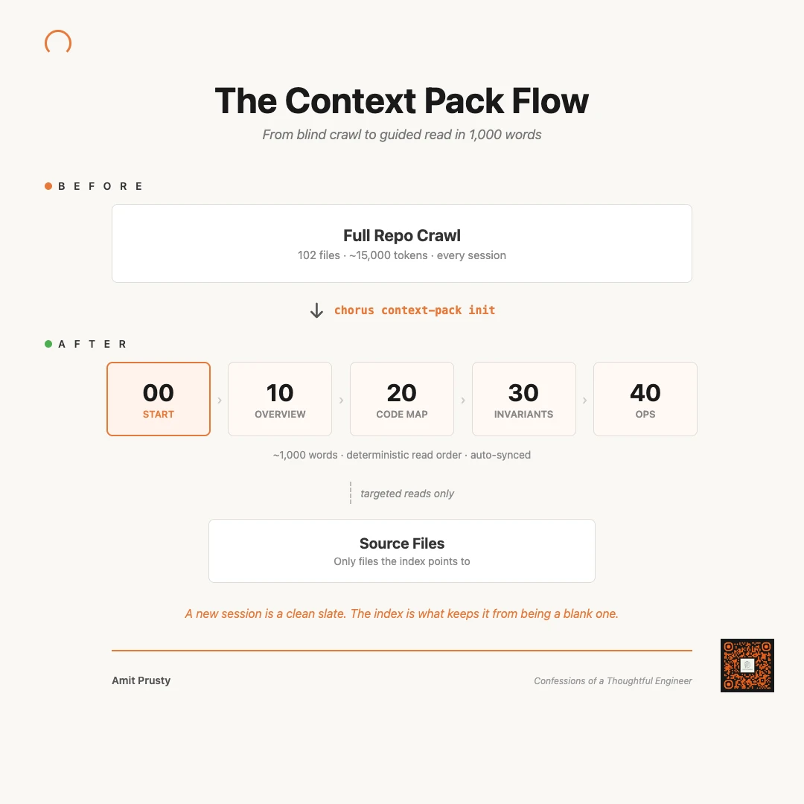
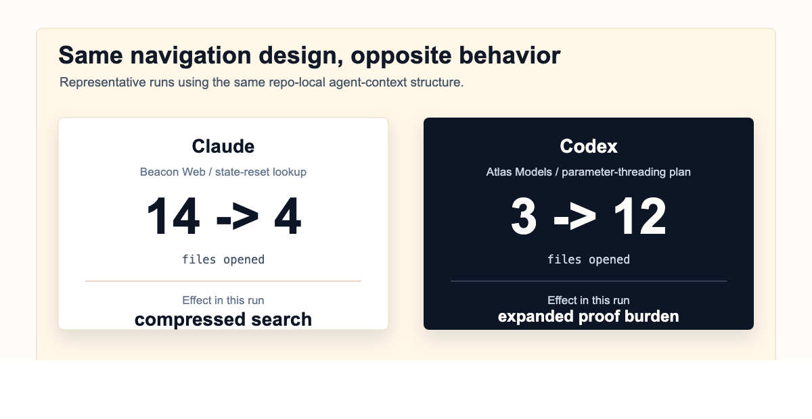
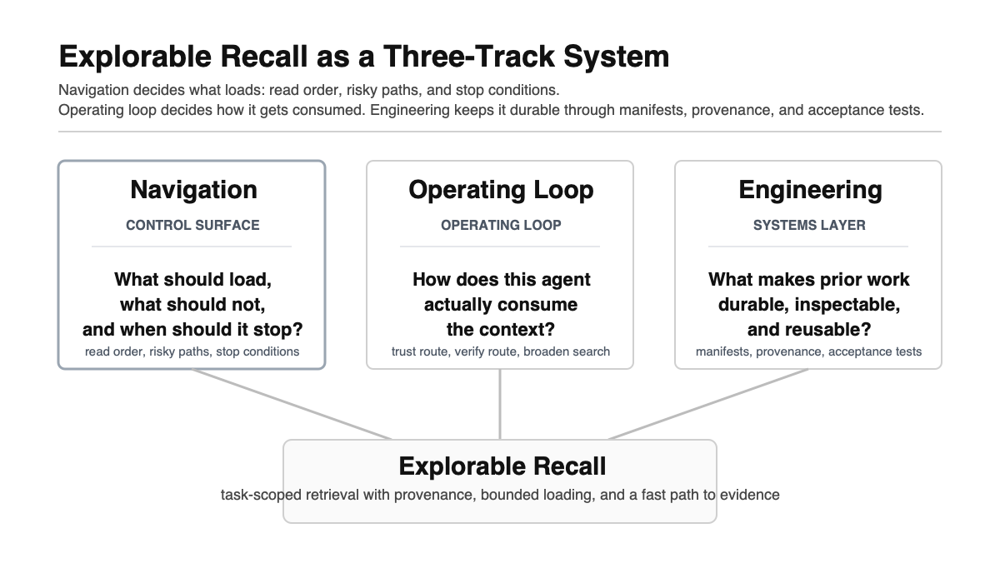
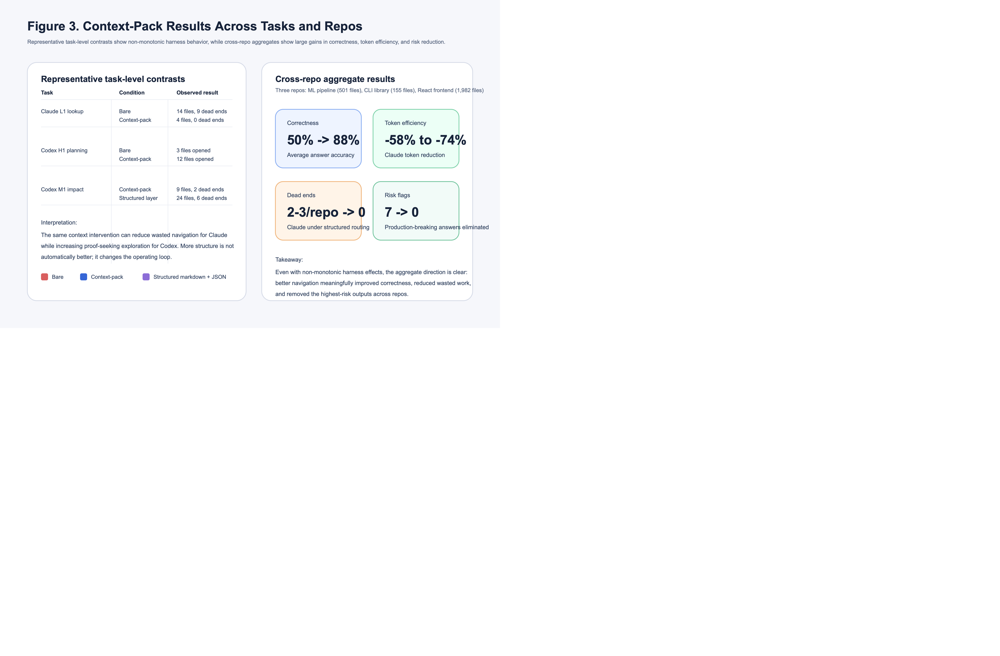

# agent-context


**Stop your AI agents from re-reading the same repo every session.**

A `.agent-context/` directory that gives any coding agent instant repo understanding — what's risky, what's connected, where to look. One pack, every agent, zero orchestrator.

> If you use AI agents (Claude, Codex, Cursor, Gemini) on repos with 50+ files, this cuts incorrect answers in half and token usage by 58-74%.



```bash
agent-context init --tier 3 .
```

**Two taxes, one fix:**
- **Cold-Start Tax** — every new session re-reads the same files from zero, hits the same dead ends, burns the same tokens on orientation.
- **Cascade Tax** — one wrong assumption about file relationships ripples into wrong plans, wrong impact analysis, and production-risk answers.

A context pack eliminates both. Agents read 5 ordered docs (~4,500 tokens) instead of scanning the repo.

## The Evidence

Tested across 3 repo types, 78+ graded experiment runs. Not self-assessed — reviewer-graded against ground truth with grep verification.

| Metric | Without pack | With pack | Change |
|--------|-------------|-----------|--------|
| Correct answers | 50% | 88% | **+76%** |
| Files opened (Claude) | 6-10 | 1-3 | **-70%** |
| Tokens used (Claude) | 40-53K | 4-22K | **-58 to -74%** |
| Dead ends | 2-3 per repo | 0 | **-100%** |
| Production-risk answers | 7 total | 0 | **eliminated** |

### Same Context, Opposite Behavior

The most interesting finding: the same pack made Claude *narrower* (14 files down to 4) while making Codex *broader* (3 files up to 12). Both got more correct.



This is not a Claude tool or a Codex tool. Different agents use the same contract differently — and both benefit.

### The Headline Stories

**"Zero files, 12 seconds"** — Claude answered a complex impact analysis question using pure context. Zero files opened. Correct answer from the completeness contract alone.

**"Both agents miss the same silent failure"** — Claude and Codex both missed `src/__tests__/setup.tsx` (the store reset that prevents flaky tests). Both found it with the pack — because one line in the behavioral invariants says: *"Zustand store schema change → setup.tsx. Silent failure if missed — tests pass individually but fail in suite."*

**"Deprecated pattern prevented"** — Claude bare proposed Apollo Client (being deprecated). Claude with context correctly used React Query — because the negative guidance says: *"Do not assume Apollo GraphQL queries are the current data path."*

Full results: [`docs/evidence/results.md`](docs/evidence/results.md) | Interactive dashboard: [context-pack-viz](https://cote-star.github.io/agent-recall/docs/)

## See It Work

### Init

Three commands, under two minutes:

```bash
git clone https://github.com/cote-star/agent-context.git
cd your-repo
/path/to/agent-context/bin/agent-context init .
```


Templates land in `.agent-context/current/`, routing blocks in `CLAUDE.md` / `AGENTS.md` / `.cursorrules`, helper tools in `.agent-context/tools/`.

### Fill + Verify

Fill the REPLACE markers in each template (or ask an agent: *"set up agent context for this repo"*), then verify:

```bash
/path/to/agent-context/bin/agent-context verify .
# OK: agent-context pack passed machine-checkable validation (tier 3)
```


### Agent-Driven Creation

Open any agent (Claude Code, Cursor, Codex) in your repo and say:

> **"Set up agent context for this repo"**

The agent follows the [`SKILL.md`](SKILL.md) — inventories subsystems, fills all 11 files, validates, runs acceptance tests with grep verification, and commits. Takes ~15 minutes for a large repo.


After merge, every agent session reads the routing block and follows the pack. No per-developer setup.

## How It Works

### The Three-Track Framework

Packs are one part of a broader design:



- **Navigation** — the pack. What the agent reads first, before touching code.
- **Harness** — the agent setup and rails around it (Cursor rules, Claude Code hooks, Codex config).
- **Engineering** — the codebase shape that makes navigation effective (file structure, naming, test patterns).

### The 3-Layer Pack

```
.agent-context/current/
├── 00_START_HERE.md             ─┐
├── 10_SYSTEM_OVERVIEW.md         │  Content layer (markdown)
├── 20_CODE_MAP.md                │  Read by humans + all agents
├── 30_BEHAVIORAL_INVARIANTS.md   │
├── 40_OPERATIONS_AND_RELEASE.md ─┘
├── routes.json                   ─┐
├── completeness_contract.json     │  Authority layer (JSON, tier 3)
├── reporting_rules.json          ─┘  Trust-and-follow agents (Claude)
├── search_scope.json             ← Navigation layer
├── manifest.json                 ← Metadata
└── acceptance_tests.md           ← Author-time quality checks
```

**Content** (5 markdown docs) — architecture, code map, invariants, ops. Deterministic read order `00 → 10 → 20 → 30 → 40`.

**Authority** (3 JSON files, tier 3) — task routing, completeness contracts ("what MUST be in the answer"), reporting rules. Claude trusts these as authoritative — result: answers from pure context, zero files opened.

**Navigation** (`search_scope.json`) — bounds WHERE search-and-verify agents (Codex, Cursor) look. Does not prescribe when to stop.

### Two Agent Architectures

| | Trust-and-follow (Claude, Gemini) | Search-and-verify (Codex, Cursor) |
|---|---|---|
| **Reads the pack as** | Authoritative | One signal among many |
| **Then** | Opens minimal files | Greps the repo to verify |
| **Benefits from** | Completeness contracts, stop rules | Search scope boundaries |
| **Does NOT benefit from** | — | Stop rules (ignores them) |

Same pack, different layers serve each architecture.

## Tiers

Not every repo needs the full pack:

| Tier | Files | Best for | Command |
|------|-------|----------|---------|
| **1** (minimal) | `20_CODE_MAP.md` + `search_scope.json` | Quick adoption, 50-100 file repos | `init --tier 1 .` |
| **2** (standard) | + start, invariants, manifest, tests | Most repos, 100-500 files | `init --tier 2 .` |
| **3** (full) | + all 5 docs + authority layer | Complex repos, 500+ files | `init .` (default) |

## Cursor Integration

`agent-context init` generates a `.cursorrules` file automatically with the search-and-verify routing:

```
1. Read .agent-context/current/routes.json → identify task type
2. Load contracts from completeness_contract.json + search_scope.json
3. Search ONLY within scoped directories defined in search_scope.json
4. Do not open repo source files before step 3
```

Cursor reads `.cursorrules` natively. No extra configuration.

## Experiment Results



Tested on:
- **stream-models** — ML pipeline, 501 files, Python
- **agent-chorus** — CLI library, 155 files, Rust + Node.js
- **trust-stream-frontend** — React frontend, 1,982 files, TypeScript

Templates are general-purpose — zero modifications needed across repo types.

## How It Compares

| | agent-context | MemGPT / Letta | CrewAI / AutoGen |
|---|:---:|:---:|:---:|
| Primitive | Static repo-level pack | Long-term LLM memory | Multi-agent orchestration |
| When to use | Cold-start for coding agents in big repos | Persona + history across chats | Coordinating multiple LLM workers |
| Runtime dependency | none (stdlib Python, shell) | Python + vector store | Python + LLM calls |
| Local-first | yes | optional | optional |

Different problem, different primitive. They stack.

## What This Repo Ships vs agent-chorus

| Capability | agent-context (here) | agent-chorus |
|---|:---:|:---:|
| Content + authority + navigation templates | yes | yes |
| `verify_context_pack.py` + `check_freshness.sh` | yes | yes |
| Python CLI (init / verify / doctor / freshness) | yes | — |
| Tier support (1/2/3) | yes | yes |
| Routing block generation (CLAUDE.md, AGENTS.md, .cursorrules) | yes | yes |
| SKILL.md (agent-driven creation) | yes | yes |
| Cross-agent session reading | **no** | yes |
| Agent-to-agent messaging | **no** | yes |
| Chorus binary dependency | **no** | yes |

If you only want the navigation contract, stay here. If you want multi-agent visibility and session coordination, pair with [agent-chorus](https://github.com/cote-star/agent-chorus).

## Go Deeper

| If you need... | Go here |
|---|---|
| Agent-driven pack creation skill | [`SKILL.md`](SKILL.md) |
| Step-by-step quickstart | [`docs/getting-started.md`](docs/getting-started.md) |
| Three-layer architecture details | [`docs/architecture.md`](docs/architecture.md) |
| 16 design principles | [`docs/design-principles.md`](docs/design-principles.md) |
| CI adaptation guidance | [`docs/ci-adaptation.md`](docs/ci-adaptation.md) |
| Full evidence and experiment data | [`docs/evidence/`](docs/evidence/) |
| Research narrative + interactive dashboard | [explorable-recall](https://cote-star.github.io/agent-recall/) |
| Multi-agent coordination tooling | [agent-chorus](https://github.com/cote-star/agent-chorus) |
| Research repo (experiments + graded runs) | [agent-recall](https://github.com/cote-star/agent-recall) |

---

Every agent session starts cold. A context pack makes it warm.

Found a bug or have a feature idea? [Open an issue](https://github.com/cote-star/agent-context/issues).
