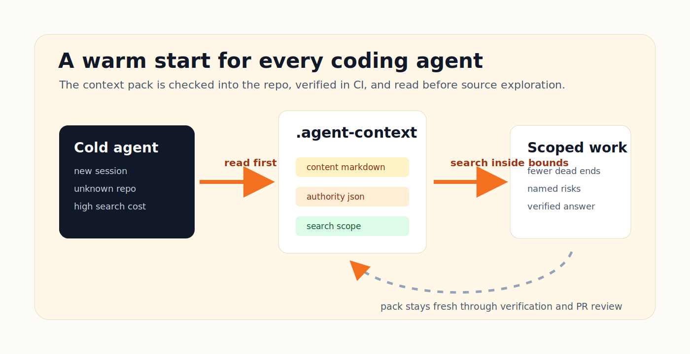

# agent-context


**A repo-native context pack that helps Claude, Codex, Cursor, and Gemini stop rediscovering the same codebase every session.**

Commit one `.agent-context/` directory to your repo. Every agent gets the same map of what exists, what is risky, which files belong together, and where to verify before it edits.


```bash
# Install once
git clone https://github.com/cote-star/agent-context.git ~/agent-context

# Add a full context pack to any repo
cd /path/to/your-repo
~/agent-context/bin/agent-context init --tier 3 .
```

## Why This Exists

Coding agents still start cold. On a large repo they spend the first part of every session re-reading directory trees, guessing boundaries, and sometimes missing the one setup file or invariant that matters.

`agent-context` turns that repeated exploration into a checked-in contract:

- **Content** for humans and all agents: system overview, code map, invariants, operations notes.
- **Authority** for trust-and-follow agents: task routes, completeness contracts, reporting rules.
- **Navigation** for search-and-verify agents: scoped directories and verification shortcuts.

The result is not a memory database, orchestrator, or hosted service. It is a small local pack that travels with the repo.



## Proof

Across 78+ reviewer-graded experiment runs on three repo types, structured packs improved answer correctness and reduced wasted exploration.

| Metric | Without pack | With pack | Change |
|---|---:|---:|---:|
| Correct answers | 50% | 88% | **+76%** |
| Files opened by Claude | 6-10 | 1-3 | **~70% fewer** |
| Tokens used by Claude | 40-53K | 4-22K | **58-74% fewer** |
| Dead ends | 2-3 per repo | 0 | **eliminated** |
| Production-risk answers | 7 total | 0 | **eliminated** |

Evidence: [full results](docs/evidence/results.md), [metrics summary](docs/evidence/metrics.md), [interactive dashboard](https://cote-star.github.io/agent-recall/docs/).


## See It Work

### 1. Initialize

```bash
~/agent-context/bin/agent-context init --tier 3 .
```


The command creates `.agent-context/current/`, copies helper tools into `.agent-context/tools/`, and writes managed routing blocks to `CLAUDE.md`, `GEMINI.md`, `AGENTS.md`, and `.cursorrules`.

### 2. Fill the Pack

Fill the `REPLACE` markers manually or ask an agent:

> Set up agent context for this repo.

The included [SKILL.md](SKILL.md) gives agents a concrete creation workflow: inventory subsystems, fill all templates, add acceptance tests, verify with grep, and run the machine checks.


### 3. Verify

```bash
~/agent-context/bin/agent-context verify .
# OK: agent-context pack passed machine-checkable validation (tier 3)
```


## What Gets Created

Tier 3, the default, creates the full 11-file pack:

```text
.agent-context/current/
├── 00_START_HERE.md
├── 10_SYSTEM_OVERVIEW.md
├── 20_CODE_MAP.md
├── 30_BEHAVIORAL_INVARIANTS.md
├── 40_OPERATIONS_AND_RELEASE.md
├── routes.json
├── completeness_contract.json
├── reporting_rules.json
├── search_scope.json
├── manifest.json
└── acceptance_tests.md
```

| Layer | Files | Main job |
|---|---|---|
| Content | `00_*` through `40_*` markdown | Human-readable map, risks, invariants, validation |
| Authority | `routes.json`, `completeness_contract.json`, `reporting_rules.json` | Tell trust-and-follow agents what must be considered |
| Navigation | `search_scope.json` | Bound search-and-verify agents to relevant directories |
| Quality | `manifest.json`, `acceptance_tests.md`, copied tools | Make the pack auditable and CI-friendly |

## Tiers

| Tier | Files | Best for | Command |
|---|---:|---|---|
| **1** minimal | 2 | Quick adoption, smaller repos | `init --tier 1 .` |
| **2** standard | 6 | Most teams starting out | `init --tier 2 .` |
| **3** full | 11 | Complex repos and production workflows | `init --tier 3 .` |

## The Design Bet

Agents do not all navigate the same way.


Claude and Gemini tend to trust explicit instructions. Codex and Cursor tend to search and verify. A useful repo context system has to serve both:

| Agent family | Reads the pack as | Best layer |
|---|---|---|
| Trust-and-follow | an authority contract | `routes.json` + completeness contracts |
| Search-and-verify | a scoped investigation map | `search_scope.json` + code map |
| Humans | operational documentation | markdown content layer |

The pack does not try to make agents stop thinking. It gives them better starting evidence and clearer boundaries.

## What This Is Not

`agent-context` is intentionally narrow:

- It does **not** store chat history or personal memory.
- It does **not** coordinate multiple agents.
- It does **not** require a server, vector database, or API key.
- It does **not** replace tests, CI, or human review.

If you want multi-agent session visibility and messaging, pair it with [agent-chorus](https://github.com/cote-star/agent-chorus).

## Compared With Nearby Tools

| | agent-context | MemGPT / Letta | CrewAI / AutoGen | agent-chorus |
|---|---|---|---|---|
| Primitive | Static repo context pack | Long-term memory | Multi-agent orchestration | Cross-agent session visibility |
| Best for | Cold-start coding work | Persona/history recall | Worker coordination | Reading and messaging agents |
| Runtime dependency | none | service/vector store optional | Python + LLM calls | chorus CLI |
| Lives in repo | yes | no | no | no |

## Roadmap

The next work is about making packs easier to author, keep fresh, and compare across repos:

- **v0.3 authoring UX**: better `doctor` output, clearer template diagnostics, and guided fixes for common verifier failures.
- **v0.4 freshness gates**: stronger CI examples for monorepos, generated files, and multiple source roots.
- **v0.5 evidence loop**: lightweight before/after measurement scripts so teams can prove whether their pack is helping.
- **Reference packs**: more real examples for backend services, frontend apps, CLIs, data pipelines, and monorepos.

Details: [docs/roadmap.md](docs/roadmap.md).

## Docs

| Need | Start here |
|---|---|
| First install | [Getting started](docs/getting-started.md) |
| Architecture | [Three-layer architecture](docs/architecture.md) |
| Design rationale | [Design principles](docs/design-principles.md) |
| CI setup | [CI adaptation](docs/ci-adaptation.md) |
| Evidence | [Experiment results](docs/evidence/results.md) |
| Agent-driven creation | [SKILL.md](SKILL.md) |
| Release history | [Release notes](RELEASE_NOTES.md) |

## Repository Boundary

This repo ships the public `agent-context` CLI, templates, verifier, examples, and evidence docs. It does not ship `chorus` session-reading commands; that belongs to [agent-chorus](https://github.com/cote-star/agent-chorus).

Found a bug or a missing pack pattern? [Open an issue](https://github.com/cote-star/agent-context/issues).
