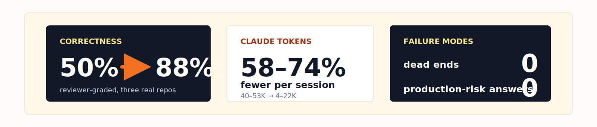
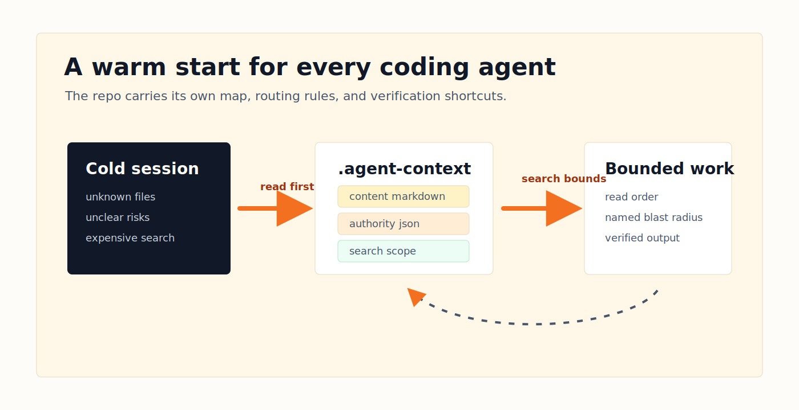
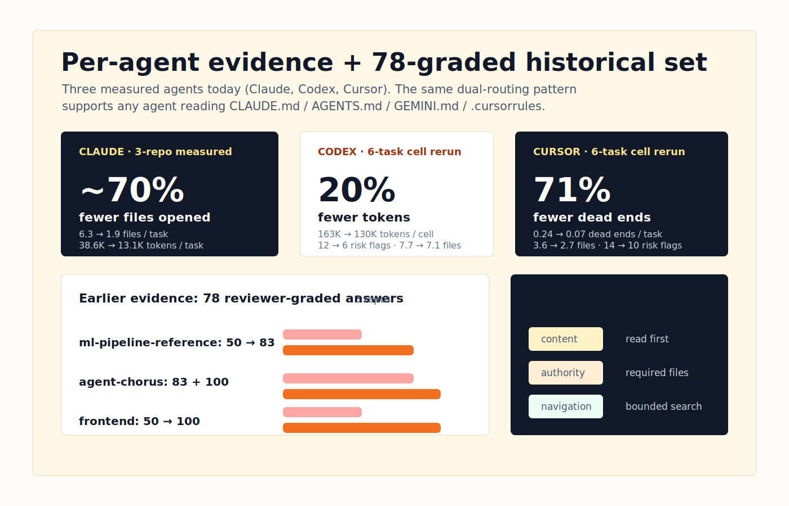
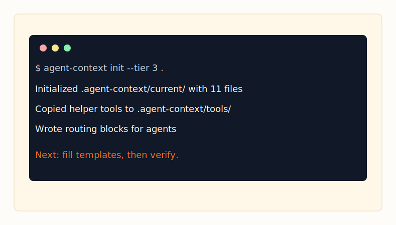
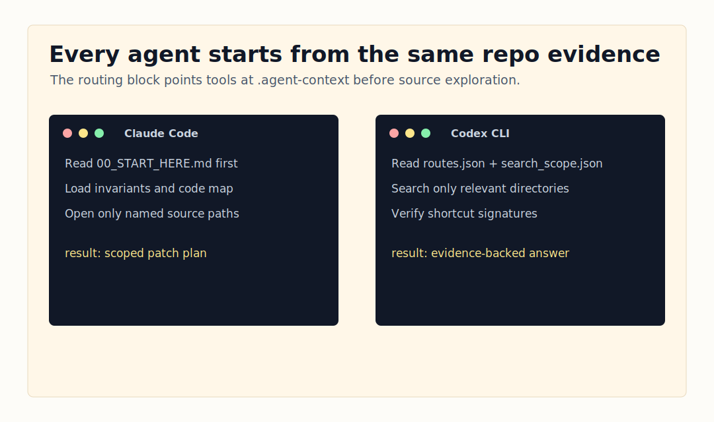
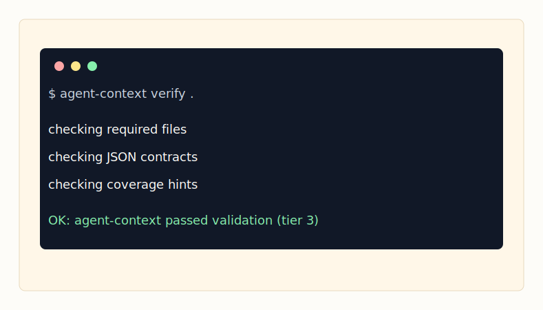
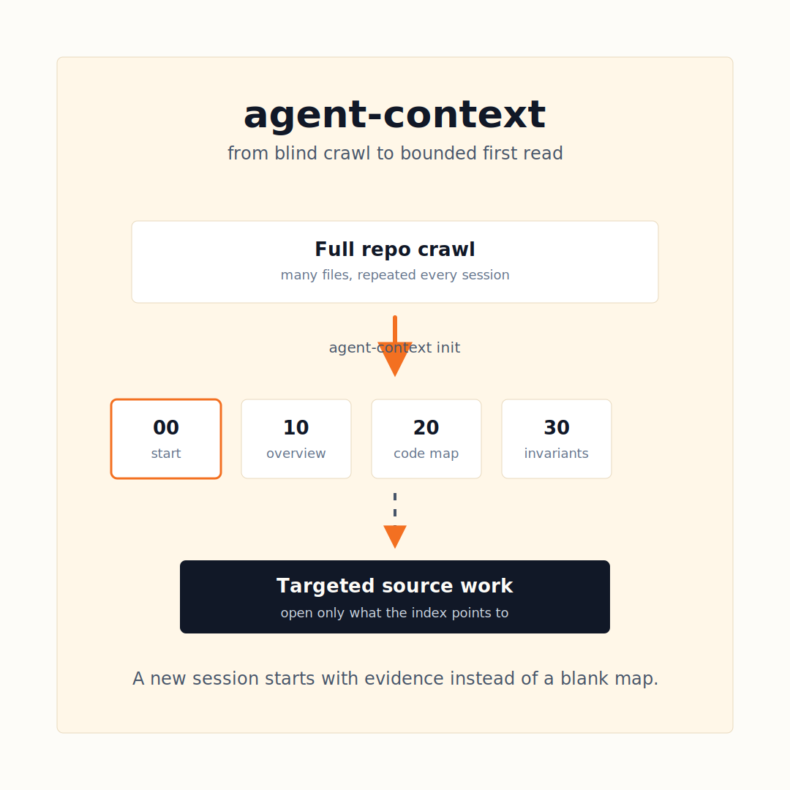
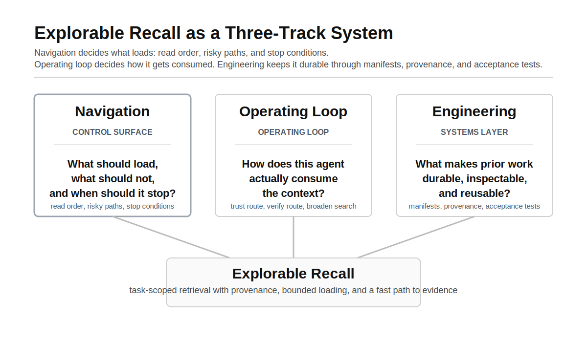

# agent-context


**Checked-in repo evidence for coding agents.**

Commit one `.agent-context/` directory to your repo. Cursor, Claude, Codex, Gemini, OpenCode, and human reviewers get the same content map, authority contracts, search boundaries, and verification hooks before anyone edits code.



```bash
# Install once
git clone https://github.com/cote-star/agent-context.git ~/agent-context

# Add the full artifact set to any repo
cd /path/to/your-repo
~/agent-context/bin/agent-context init --tier 3 .
```

> Or skip the manual fill and let an agent do it: open Cursor / Claude / Codex / Gemini / OpenCode in the repo and ask **"Set up agent context for this repo."** The included [SKILL.md](SKILL.md) drives the rest.

## Features

| | Feature | Why it matters | Where in this README |
|---:|---|---|---|
| 1 | **Works across agents** | Cursor, Claude, Codex, Gemini, and OpenCode all read the same `.agent-context/` through routing blocks in `.cursorrules` / `CLAUDE.md` / `AGENTS.md` / `GEMINI.md` — one pack, two reading patterns (trust-and-follow vs search-and-verify) | [§Architecture](#architecture) |
| 2 | **Quantified evidence** | 78+ reviewer-graded answers across three real repos, with grep-backed verification of every claim | [§Results](#results) |
| 3 | **Tiered adoption** | Start with 2 files, scale to 11 — every tier is a valid stopping point | [§Tiers](#tiers) |
| 4 | **Agent-creatable** | One prompt — `Set up agent context for this repo.` — fills the whole pack via the included skill | [SKILL.md](SKILL.md) |
| 5 | **Machine-checkable** | `verify`, `freshness`, and `doctor` make every artifact auditable in CI | [§How it works](#how-it-works) |
| 6 | **Zero infra** | Markdown + JSON committed to your repo — no server, vector store, or API key | [§The cold-start tax](#the-cold-start-tax) |

## The cold-start tax

Every coding agent session starts cold. On a real repo it spends the first chunk of every task re-reading the directory tree, guessing ownership boundaries, and missing the one setup file or invariant that should have shaped the answer. That cost compounds over every question, every reviewer, every agent.

`agent-context` turns that repeated exploration into a small, reviewable evidence layer that lives beside the code:

- **Content** — system overview, code map, behavioral invariants, operations notes.
- **Authority** — task routes, completeness contracts, and reporting rules for agents that follow explicit instructions.
- **Navigation** — scoped directories and verification shortcuts for agents that search before trusting.
- **Quality** — manifests, acceptance tests, copied helper tools, and CI-friendly checks.

It is **not** a memory database, orchestrator, crawler, or hosted service. No server, vector store, or API key. Markdown and JSON, committed to your repo.



## Results

78+ reviewer-graded runs across three real repos — an ML pipeline (501 files), a dual Rust/Node.js CLI (155 files), and a React frontend (1,982 files) — with grep-backed verification of every answer.

May 2, 2026 focused rerun on the CLI/library protocol (one-repo rerun):

- **Cursor Agent 3.2.11** (`composer-2-fast`): self-reported task-local files opened **35 → 18** with the pack. Reviewer grade unchanged (3 yes / 3 partial in both conditions).
- **Codex CLI 0.128.0**: self-reported task-local files opened **58 → 30** with the pack. Reviewer grade unchanged (5 yes / 1 partial in both conditions).

The current rerun supports the navigation-efficiency claim for Cursor and Codex, not a fresh correctness lift. Cursor evidence is provisional (one repo, one model, no Chorus-extracted Cursor session telemetry).

| Metric | Bare session | With agent-context | Change |
|---|---:|---:|---:|
| Correct answers | 50% | 88% | **+76%** |
| Files opened by Claude | 6–10 | 1–3 | **~70% fewer** |
| Tokens used by Claude | 40–53K | 4–22K | **58–74% fewer** |
| Dead ends | 2–3 per repo | 0 | **eliminated** |
| Production-risk answers | 7 total | 0 | **eliminated** |



→ [Full results](docs/evidence/results.md) · [metrics summary](docs/evidence/metrics.md) · [evidence dashboard](https://cote-star.github.io/agent-recall/docs/)

### Definitions

Every claim above maps to an operational definition and a citation in the evidence docs.

| Term | What we count | Source |
|---|---|---|
| **Correct answer** | Reviewer judges all required claims true and complete; reported as the "yes rate" across 78 graded answers | [`docs/evidence/results.md`](docs/evidence/results.md) §Correctness |
| **Files opened** | Source files the agent reads via the `Read` tool during one task — `grep` and `find` listings excluded | [`docs/evidence/results.md`](docs/evidence/results.md) §Efficiency |
| **Tokens** | Per-session total of prompt + response tokens, reported in K | [`docs/evidence/results.md`](docs/evidence/results.md) §Efficiency |
| **Dead end** | A file the agent opens that turns out to be irrelevant to the task — P8: *"track files opened that turned out irrelevant as the primary metric, not just file count"* | [`docs/design-principles.md`](docs/design-principles.md) P8 |
| **Production-risk answer** | An answer that, if acted on, would break production: wrong API, wrong file, missing invariant | [`docs/evidence/results.md`](docs/evidence/results.md) §Risk Flags |
| **Time-to-answer** | One observed task hit zero files and **12 seconds** end-to-end with the pack — vs. multi-minute baselines. Aggregate time measurement is on the v0.5 roadmap. | [`docs/evidence/results.md`](docs/evidence/results.md) §Best Stories · [v0.5 roadmap](docs/roadmap.md) |

## How it works

### 1. Initialize

```bash
~/agent-context/bin/agent-context init --tier 3 .
```



Creates `.agent-context/current/`, copies helper tools into `.agent-context/tools/`, and writes managed routing blocks to `CLAUDE.md`, `GEMINI.md`, `AGENTS.md`, and `.cursorrules`.

### 2. Fill the artifacts

Edit the `REPLACE` markers manually, or hand the work to an agent:

> Set up agent context for this repo.

[SKILL.md](SKILL.md) gives the agent a concrete creation workflow — enumerate every subsystem first (so nothing silently gets skipped), fill all templates, write acceptance tests with grep verification, then run the machine checks.



### 3. Verify

```bash
~/agent-context/bin/agent-context verify .
# OK: agent-context passed machine-checkable validation (tier 3)

~/agent-context/bin/agent-context freshness . --base-ref origin/main
~/agent-context/bin/agent-context doctor
```



`verify` checks structure, JSON schema, real glob matches, and template-variable elimination. `freshness` flags drift between code and pack. `doctor` audits local setup. All three are CI-friendly.

## Architecture

The core design is dual routing — **same artifacts, opposite agent loops**. One pack, two reading patterns:

```text
Search-and-verify (Cursor, Codex, OpenCode w/ local model)
  search_scope   →  scoped grep     →  verification shortcut  →  answer

Trust-and-follow (Claude, Gemini, OpenCode w/ Anthropic backend)
  routing block  →  required files  →  completeness contract  →  answer
```

The same `.agent-context/` content is consumed differently by each agent family. Cursor, Codex, and OpenCode (with a local model backend) bound their grep to scoped directories and cross-check verification shortcuts. Claude, Gemini, and OpenCode (with an Anthropic backend) stop when the completeness contract says done. agent-context provides scaffolding for both — completeness contracts for trust-and-follow agents, bounded search for search-and-verify agents.

**Model-agnostic by construction.** The pack is markdown and JSON; routing blocks are plain text. Operator-verified with OpenCode running locally on a Mac and pointing at an OSS model (Devstral Small 2 or Qwen 4B) via SSH tunnel to a separate inference host — the pack reads identically regardless of where the model runs or which vendor ships it.



| Layer | Files | Job |
|---|---|---|
| **Content** | `00_*` through `40_*` markdown | Human-readable map, risks, invariants |
| **Authority** | `routes.json`, `completeness_contract.json`, `reporting_rules.json` | What MUST be in a complete answer |
| **Navigation** | `search_scope.json` | Bound search-and-verify agents to relevant dirs |
| **Quality** | `manifest.json`, `acceptance_tests.md`, helper tools | Make the pack auditable and CI-checkable |



```text
.agent-context/current/
├── 00_START_HERE.md
├── 10_SYSTEM_OVERVIEW.md
├── 20_CODE_MAP.md
├── 30_BEHAVIORAL_INVARIANTS.md
├── 40_OPERATIONS_AND_RELEASE.md
├── routes.json
├── completeness_contract.json
├── reporting_rules.json
├── search_scope.json
├── manifest.json
└── acceptance_tests.md

.agent-context/tools/
├── verify_agent_context.py
└── check_freshness.sh
```

→ [Architecture deep-dive](docs/architecture.md) · [16 design principles](docs/design-principles.md)

## Tested repositories

The same `.agent-context/` template has been validated across stacks and across two orders of magnitude in repo size — with **zero modifications**.

| Repo | Files | Stack | Result |
|---|---:|---|---|
| ML pipeline (`stream-models`) | 501 | Python | 50% → 83% correct · 74% fewer tokens · 0 dead ends |
| Dual CLI (`agent-chorus`) | 155 | Rust + Node.js | Historical: Codex 6/6 (highest of any condition) · Claude 69% fewer tokens. May 2026 rerun: **Cursor 35 → 18 files** · Codex 58 → 30 files |
| React frontend (`trust-stream-frontend`) | 1,982 | TypeScript | 50% → 100% correct · 58% fewer tokens · 0 dead ends |

**Repo-agnostic by design.** Principle P1 ([`docs/design-principles.md`](docs/design-principles.md)) is tagged `[all repos]` — the artifact set is built to "apply regardless of repo type, size, or stack."

**Non-code corpora — not yet tested.** The same content + authority + navigation pattern is designed to generalize to datasets, design systems, runbooks, and other stable corpora that an agent must read before acting. Currently validated only on code repos. The first non-code corpus test is on the [v0.5 roadmap](docs/roadmap.md).

## Tiers

Start small. Scale when the team is ready. Each tier is a valid stopping point — no hidden dependency on the full pack.

| Tier | Files | Best for | Command |
|---|---:|---|---|
| **1** minimal | 2 | Quick adoption, smaller repos | `init --tier 1 .` |
| **2** standard | 6 | Most teams starting out | `init --tier 2 .` |
| **3** full | 11 | Complex repos, production workflows | `init --tier 3 .` |

## Examples

Two worked examples ship in this repo. Both pass `verify` as-is — clone, read, adapt.

| Example | Size | Why look at it |
|---|---|---|
| [`examples/hello-service/`](examples/hello-service/) | 6 files, ~300 LOC HTTP service | Read the whole pack in five minutes |
| [`examples/agent-chorus-reference/`](examples/agent-chorus-reference/) | 155 files, dual Rust/Node.js CLI | Real repo, full tier 3 pack — scored 6/6 with Codex, 69% token savings with Claude |

## Comparison

| | agent-context | MemGPT / Letta | CrewAI / AutoGen | agent-chorus |
|---|---|---|---|---|
| **Primitive** | Checked-in repo evidence | Long-term memory | Multi-agent orchestration | Cross-agent session visibility |
| **Best for** | Cold-start coding work, PR-scoped guidance | Persona/history recall | Worker coordination | Reading and messaging agents |
| **Runtime dependency** | none | service / vector store optional | Python + LLM calls | chorus CLI |
| **Lives in repo** | yes | no | no | no |

For multi-agent session visibility and messaging, pair with [agent-chorus](https://github.com/cote-star/agent-chorus).

## Roadmap

- **v0.3 authoring UX** — better `doctor` output, clearer template diagnostics, guided fixes for common verifier failures.
- **v0.4 freshness gates** — stronger CI examples for monorepos, generated files, and multiple source roots.
- **v0.5 evidence loop** — lightweight before/after measurement scripts so teams can prove agent-context is helping.
- **Reference packs** — backend services, frontend apps, CLIs, data pipelines, monorepos.

→ [Full roadmap](docs/roadmap.md)

## Documentation

Each doc maps to one of the features above (or to general onboarding).

| Need | Document | Feature |
|---|---|---|
| First install | [Getting started](docs/getting-started.md) | — |
| Architecture deep-dive | [Architecture guide](docs/architecture.md) | Dual-mode routing |
| Evidence | [Experiment results](docs/evidence/results.md) · [metrics summary](docs/evidence/metrics.md) | Quantified evidence |
| Agent-driven creation | [SKILL.md](SKILL.md) | Agent-creatable |
| CI setup | [CI adaptation](docs/ci-adaptation.md) | Machine-checkable |
| Design rationale | [16 design principles](docs/design-principles.md) | — |
| Release history | [Release notes](RELEASE_NOTES.md) | — |

## Project scope

The public `agent-context` CLI, templates, verifier, examples, and evidence docs live here. `chorus` session-reading commands live in [agent-chorus](https://github.com/cote-star/agent-chorus).

Found a bug or a missing repo pattern? [Open an issue](https://github.com/cote-star/agent-context/issues).
