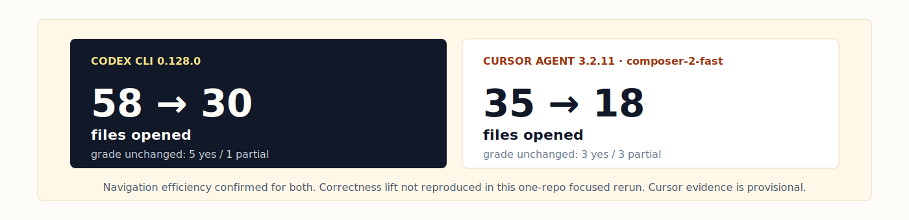
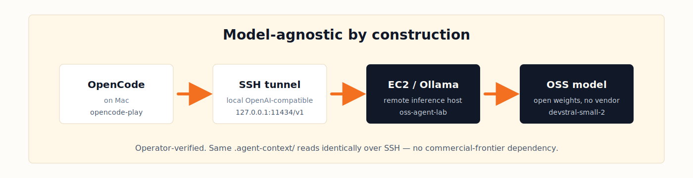

<!--
Cursor Meetup, May 2026
Talk: agent-context — checked-in repo evidence for coding agents

Format: Marp markdown. Renders to PDF / HTML / PPTX:
  npx @marp-team/marp-cli@latest cursor-meetup-may-2026.md -o cursor-meetup-may-2026.pdf
  npx @marp-team/marp-cli@latest cursor-meetup-may-2026.md -o cursor-meetup-may-2026.html
  npx @marp-team/marp-cli@latest cursor-meetup-may-2026.md -o cursor-meetup-may-2026.pptx

Slide breaks are `---` on its own line. SVGs paths are relative to this file
(../docs/visuals/* and ../docs/demos/* and ../docs/evidence/figures/*).
-->
---
marp: true
theme: default
paginate: true
size: 16:9
backgroundColor: '#FDFCF8'
color: '#111827'
style: |
  section {
    font-family: Inter, -apple-system, BlinkMacSystemFont, sans-serif;
    background-color: #FDFCF8;
    color: #111827;
    padding: 60px;
  }
  section.lead {
    text-align: center;
    justify-content: center;
  }
  h1 { color: #111827; font-weight: 800; font-size: 1.7em; }
  h2 { color: #111827; font-weight: 800; border-bottom: 3px solid #F37021; padding-bottom: 0.2em; }
  h3 { color: #475569; font-weight: 600; }
  code {
    background-color: #FFF7E8;
    color: #111827;
    padding: 0.1em 0.3em;
    border-radius: 4px;
    font-family: ui-monospace, SFMono-Regular, Menlo, monospace;
  }
  pre {
    background-color: #FFF7E8;
    border: 1px solid #E8D9BE;
    border-radius: 8px;
    padding: 1em;
    font-size: 0.85em;
  }
  pre code { background-color: transparent; padding: 0; }
  a { color: #F37021; text-decoration: none; overflow-wrap: anywhere; }
  a:hover { text-decoration: underline; }
  strong { color: #111827; font-weight: 700; }
  em { color: #475569; }
  blockquote {
    border-left: 4px solid #F37021;
    padding-left: 1em;
    color: #475569;
    margin-left: 0;
    font-style: italic;
  }
  ul li::marker { color: #F37021; }
  ol li::marker { color: #F37021; }
  table { border-collapse: collapse; width: 100%; }
  th, td { padding: 0.4em 0.8em; border-bottom: 1px solid #E8D9BE; }
  th { background-color: #FFF7E8; text-align: left; }
  img { display: block; margin: 0 auto; max-height: 75vh; }
  section::after {
    color: #64748B;
    font-size: 0.65em;
  }
---

<!-- _class: lead -->

# agent-context

### Stop re-teaching your repo to every coding agent

Checked-in maps, boundaries, and checks that agents read before editing.

What we built · what held up · what we narrowed

Cursor Meetup · May 2026
[github.com/cote-star/agent-context](https://github.com/cote-star/agent-context)

---

## The cold-start tax

A familiar Cursor meetup moment:

- the agent re-reads the tree
- it guesses ownership boundaries
- it misses the invariant that should have shaped the answer

The model is smart. The session is still a stranger to your repo.

Same shape across **Claude, Codex, Cursor, Gemini, OpenCode**. The tax compounds across every question, reviewer, and agent.


---

## One folder, every agent

Commit `.agent-context/` to your repo: a small, reviewable evidence layer beside the code.

Not memory. Not RAG. Not another hosted service.

`init` writes the same routing block into four standard project-rule files. Modern agents read several of these **together** — not 1:1 — so the redundancy is the feature.

| Routing file | Common pick-ups |
|---|---|
| `.cursorrules` | Cursor |
| `CLAUDE.md` | Claude · Claude Code · Cursor |
| `AGENTS.md` | Codex · OpenCode · Cursor |
| `GEMINI.md` | Gemini |

**One pack. Four routing files. Any one can route the agent to the same context.**

---

## Three layers, one pack


| Layer | Files | Job |
|---|---|---|
| **Content** | `00_*` through `40_*` markdown | What is this system? What matters? |
| **Authority** | `routes.json`, contracts, reporting rules | What must a complete answer include? |
| **Navigation** | `search_scope.json` | Where should search-and-verify agents look first? |

Quality wraps all three: manifest, acceptance tests, `verify`, and `freshness`.

---

## Two reading patterns, one pack

```text
Search-and-verify  (Codex, Cursor, OpenCode w/ local model)
  search_scope   →  scoped grep   →  verification shortcut  →  answer

Trust-and-follow   (Claude, Gemini, OpenCode w/ Anthropic backend)
  routing block  →  required files  →  completeness contract  →  answer
```

Same content. Two reading paths.

That is the design constraint: one repo artifact has to help agents that verify by search and agents that follow explicit contracts.

---

## Live demo · init

```bash
$ cd examples/hello-service
$ ~/agent-context/bin/agent-context init --tier 3 .
Initialized .agent-context/current/ with 11 files (tier 3)
Copied helper tools to .agent-context/tools/
Wrote routing block in CLAUDE.md
Wrote routing block in AGENTS.md
Wrote routing block in GEMINI.md
Wrote routing block in .cursorrules
```

This is the mechanical part: create the pack, copy local checks, and route all agent entry points to the same first reads.

---

## Live demo · agent fills the pack

> **"Set up agent context for this repo."**


[`SKILL.md`](../SKILL.md) drives the agent:

1. enumerate subsystems first, so nothing silently gets skipped
2. fill all 11 templates
3. write acceptance tests with grep verification
4. run the machine checks

---

## Live demo · verify

```bash
$ ~/agent-context/bin/agent-context verify .
OK: agent-context passed machine-checkable validation (tier 3)
```

Checks: structure · JSON schema · real glob matches · template-marker elimination.

CI-friendly. Pair with `freshness` (drift detection) and `doctor` (env diagnostics).

---

## Success stories worth telling


- **Zero files, 12 seconds:** complex impact analysis answered from context alone.
- **Silent test failure caught:** bare agents missed the store-reset invariant; structured agents found it.
- **Deprecated pattern avoided:** context steered planning away from Apollo and toward React Query.
- **Codex 6/6:** highest historical score on the dual CLI/library protocol.

These are the stories to tell first: context works when repo-specific knowledge decides the answer.

---

## Evidence, not vibes


78+ reviewer-graded answers across three repos:

- ML pipeline · 501 files · Python
- Dual CLI · 155 files · Rust + Node.js
- React frontend · 1,982 files · TypeScript

Same template, zero modifications. Production-risk answers went to zero in the structured condition.

---

## Freshness is the quality gate



The May rerun taught one important thing: a stale pack is not a success metric or a failure metric.

It is a maintenance failure. Discard it, update the pack, and rerun.

Before stage:

- `agent-context verify`
- `agent-context freshness`
- Codex + Cursor: bare vs `structured_fresh`
- human reviewer grading against ground truth

---

## Model-agnostic by construction



The pack is markdown and JSON; routing blocks are plain text.

Operator-verified with **OpenCode + OSS model** (Devstral Small 2 / Qwen 4B) over an SSH tunnel.

The point is portability: repo context should not depend on one vendor, one editor, or one hosted memory layer.

---

## The honest claim

**agent-context reduces wrong turns by making repo knowledge explicit before the agent edits.**

- Strongest when repo-specific invariants decide the answer.
- Freshness is part of the product, not an afterthought.
- Success is measured by reviewer grade, file opens, dead ends, and risk flags.
- Start at tier 1, scale only when the repo needs it.

Not magic intelligence. Better starting evidence.

---

## Try it tonight

```bash
git clone https://github.com/cote-star/agent-context.git ~/agent-context
cd /path/to/your-repo
~/agent-context/bin/agent-context init --tier 1 .
```

Or open the repo in your agent of choice and ask:

> **Set up agent context for this repo.**

Start small: tier 1 is two files. Move to tier 3 when the repo needs routes, search scopes, and CI checks.

**One folder. Every coding agent. Read before any edit.**

[github.com/cote-star/agent-context](https://github.com/cote-star/agent-context)

---

<!-- _class: lead -->

## Questions

[github.com/cote-star/agent-context](https://github.com/cote-star/agent-context)

`agent-context init` · `verify` · `freshness` · `doctor`

Thank you.
